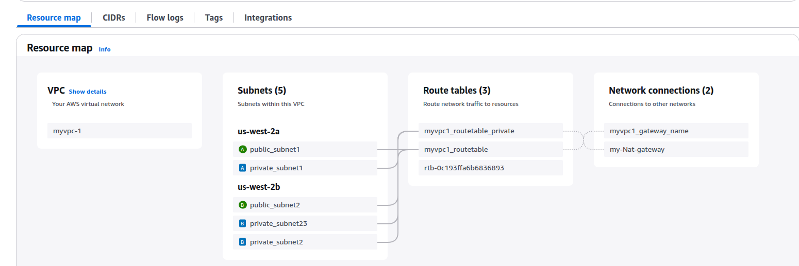

## Introduction
Kubernetes has become the go-to solution for orchestrating containerized applications, enabling scalability, efficiency, and automation in modern application deployments. Amazon Elastic Kubernetes Service (EKS) further simplifies this by providing a managed Kubernetes environment, reducing the operational overhead of maintaining Kubernetes clusters. But as powerful as EKS is, provisioning and managing its infrastructure manually can be time-consuming, error-prone, and challenging to maintain at scale.

This is where Terraform comes in—a powerful Infrastructure as Code (IaC) tool that allows you to define, provision, and manage your cloud infrastructure in a consistent and repeatable way. By using Terraform, you can automate the deployment of your EKS clusters, ensuring they are configured correctly and are easily reproducible.

## Step-by-Step Guide to Setting Up an EKS Cluster with Terraform

Creating a VPC for Your EKS Cluster
Learn how to define and provision a Virtual Private Cloud (VPC) that provides a secure and scalable networking environment for your EKS cluster.

Configuring an Internet Gateway
Set up an Internet Gateway to enable public access to your resources within the VPC, facilitating outbound internet connectivity.

Setting Up a NAT Gateway
Configure a NAT Gateway to allow private subnets in your VPC to securely access the internet while keeping them isolated from inbound connections.

Provisioning an EKS Cluster
Deploy a fully functional Amazon Elastic Kubernetes Service (EKS) cluster within your VPC, ready to orchestrate containerized applications.


## vpc creation using terraform
in this section we will be creating vpc using terraform 
```javascript
module "myvpc1" {
  source = "./Modules/Vpc"
  subnet_configurations-public = var.subnet_configurations-public
  subnet_configurations-private = var.subnet_configurations-private
  Env = var.Env
  my_vpc_name = var.my_vpc_name
  gateway_name = var.gateway_name
  route_table_name = var.route_table_name  
  route_table_name_private =var.route_table_name_private
  createnatgateway = var.createnatgateway
}
```
## EKS creation using terraform
in this section we will be creating EKS cluster using terraform 
```javascript
module "my-cluster1" {
source = "./Modules/Eks"
ekscluster-role-name = var.ekscluster-role-name
myekscluster-nodegroup-role-name = var.myekscluster-nodegroup-role-name
Env = var.Env
subnet_ids = module.myvpc1.private_subnet_ids
cluster-name = var.cluster-name
node_group_name= var.node_group_name
arn_iamuser_access_to_cluster = var.arn_iamuser_access_to_cluster 
}
```

## COMMANDS: terraform resuorce creation and deleting resources
```javascript
terraform init
terraform apply -var-file="dev.tfvars"
terraform destroy -var-file="dev.tfvars"

```
## COMMAND: Connect to the EKS cluster to get kube config file 
```bash
aws eks update-kubeconfig --name my-cluster1 --region us-west-2 
```


## RESULT
### vpc

### eks cluser

### worker node

### get kube config file from eks cluster

### check all worker nodes with kubectl


